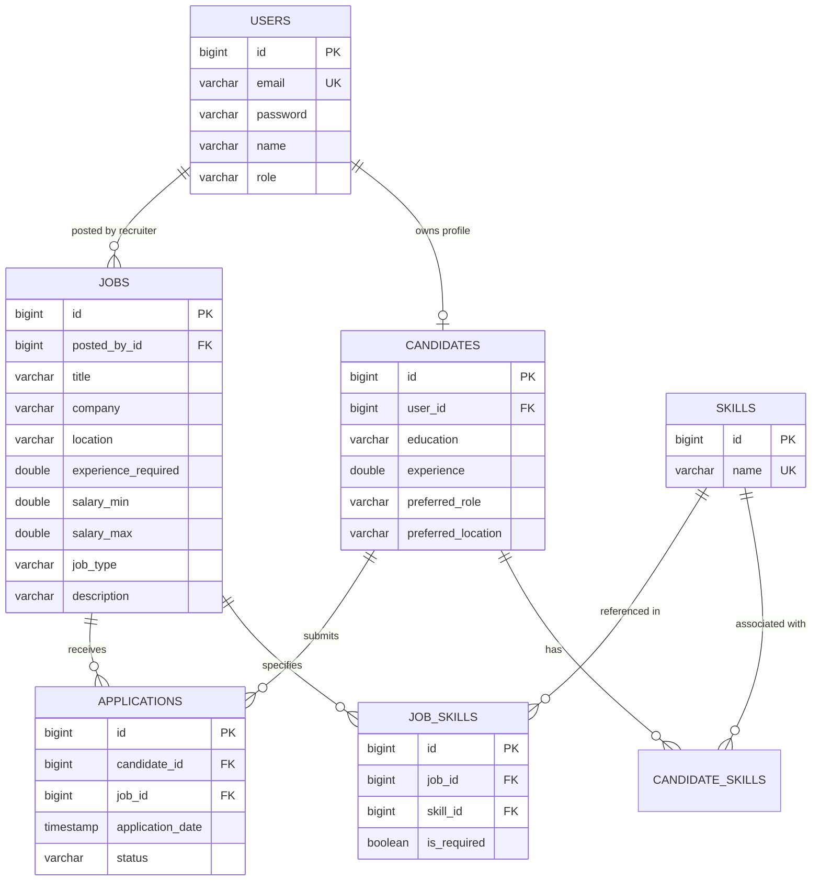

# SmartJob — Smart Job Matching & Skill Gap Analysis System

> **Version 2 — Full-Stack Enterprise REST API & Relational Database Architecture**

[](https://www.oracle.com/java/)
[](https://spring.io/projects/spring-boot)
[](https://spring.io/projects/spring-security)
[](https://hibernate.org/)
[](https://www.postgresql.org/)
[](http://localhost:8080/swagger-ui.html)
[]()

---

## 1. Project Overview

**SmartJob Version 2** transitions the system from a standalone, console-based Java application into a **production-ready, enterprise RESTful backend**. 

While **Version 1** proved the core mathematical and algorithmic concepts using fundamental Data Structures & Algorithms (DSA) and CSV flat-file persistence, **Version 2** modernizes the architecture to enterprise standards:
- **Stateless Authentication**: Secured with JSON Web Tokens (JWT) and BCrypt password encryption.
- **Role-Based Access Control (RBAC)**: Distinct permissions for `CANDIDATE`, `RECRUITER`, and `ADMIN`.
- **Relational Persistence**: Fully normalized entity model managed by Spring Data JPA and Hibernate, supporting both zero-config in-memory **H2** (for instant development) and **PostgreSQL** (for production).
- **Algorithmic Preservation**: Preserves 100% of Version 1's algorithmic intelligence—including weighted scoring, composite match formulas, and **Max-Heap PriorityQueue Top-K ranking**—encapsulated behind clean REST APIs.
- **Interactive Documentation**: Embedded **Swagger UI & OpenAPI 3.0** documentation for live API exploration and testing.

---

## 2. Version 1 vs. Version 2 Comparison

| Feature | Version 1 (`main` branch) | Version 2 (`version-2` branch) |
|---|---|---|
| **Architecture** | Console CLI application | N-Tier RESTful microservice backend |
| **Framework** | Plain Core Java (No dependencies) | Spring Boot 3.2.5 + Spring MVC |
| **Data Storage** | Comma-Separated Values (`.csv`) files | Relational DB: H2 (dev) & PostgreSQL (prod) |
| **ORM / Data Layer** | Custom `BufferedReader`/`BufferedWriter` parser | Spring Data JPA + Hibernate ORM |
| **Security** | None (Single local user console session) | Spring Security 6 + Stateless JWT + BCrypt |
| **User Roles** | Implicit | `ROLE_CANDIDATE`, `ROLE_RECRUITER`, `ROLE_ADMIN` |
| **API Docs** | Manual CLI menu help | Swagger UI / OpenAPI 3.0 (`/swagger-ui.html`) |
| **Testing** | Custom console `TestRunner` | JUnit 5 + Mockito + Spring Boot Test suites |
| **Build System** | Batch scripts (`compile.bat`) / `javac` | Apache Maven (`pom.xml`) + Maven Wrapper |

---

## 3. Technology Stack

* **Language**: Java 17+ (LTS)
* **Framework**: Spring Boot 3.2.5
* **Security**: Spring Security 6.x + JJWT (`io.jsonwebtoken` 0.12.5) + BCrypt Password Encoder
* **Persistence & ORM**: Spring Data JPA, Hibernate 6.x, Jakarta Persistence API
* **Databases Supported**:
  * **H2 Database** (Default in-memory engine, zero setup required)
  * **PostgreSQL 14+** (Enterprise production profile)
* **API Documentation**: SpringDoc OpenAPI UI 2.5.0 (`/swagger-ui.html`)
* **Validation**: Jakarta Bean Validation (`@NotBlank`, `@Email`, `@Min`, `@NotNull`)
* **Testing**: JUnit Jupiter 5.10, Mockito, Spring Boot Starter Test

---

## 4. System Architecture & Directory Structure

```
src/main/java/com/smartjob/
├── SmartJobApplication.java         ← Spring Boot application entry point
├── config/                          ← Infrastructure & security configuration
│   ├── SecurityConfig.java          ← Filter chain, CORS/CSRF, RBAC endpoint rules
│   ├── OpenApiConfig.java           ← OpenAPI 3.0 & Swagger UI configuration
│   └── DataSeeder.java              ← Automatic startup database seeding
├── controller/                      ← REST API Controllers (JSON endpoints)
│   ├── AuthController.java          ← Registration, login & JWT generation
│   ├── CandidateController.java     ← Candidate profile & skill management
│   ├── JobController.java           ← Job posting CRUD & multi-criteria filtering
│   ├── MatchingController.java      ← Match scores, PriorityQueue Top-K, skill gap
│   └── ApplicationController.java   ← Job applications & status lifecycle
├── dto/                             ← Data Transfer Objects (Validation & decoupling)
│   ├── request/                     ← Inbound payloads (@Valid requests)
│   └── response/                    ← Outbound JSON response models
├── entity/                          ← JPA Entities (Database relational mapping)
│   ├── User.java                    ← User authentication & roles
│   ├── Candidate.java               ← Candidate profile details
│   ├── Skill.java                   ← Normalized skill library
│   ├── Job.java                     ← Job listings with required experience & salary
│   ├── JobSkill.java                ← Weighted association (Required vs. Preferred)
│   ├── Application.java             ← Candidate-to-Job application lifecycle
│   └── enums/                       ← Role, JobType, ApplicationStatus
├── exception/                       ← Centralized exception handling
│   ├── GlobalExceptionHandler.java  ← @RestControllerAdvice mapping errors to JSON
│   ├── ResourceNotFoundException.java
│   ├── DuplicateResourceException.java
│   ├── InvalidRequestException.java
│   └── ForbiddenException.java
├── mapper/                          ← Entity-to-DTO conversion layer
│   └── EntityMapper.java            ← Clean mapping between entities and DTOs
├── repository/                      ← Spring Data JPA Repositories
│   ├── UserRepository.java
│   ├── CandidateRepository.java
│   ├── JobRepository.java
│   ├── SkillRepository.java
│   ├── JobSkillRepository.java
│   └── ApplicationRepository.java
├── security/                        ← JWT processing components
│   ├── JwtTokenProvider.java        ← Token generation, signature & claims parsing
│   └── JwtAuthenticationFilter.java  ← Per-request Bearer token extraction
└── service/                         ← Business logic layer
    ├── CandidateServiceV2.java
    ├── JobServiceV2.java
    ├── MatchingServiceV2.java       ← Core DSA engine (PriorityQueue & scoring)
    ├── ApplicationServiceV2.java
    └── SkillServiceV2.java
```

---

## 5. Core Algorithmic Formulations (Integrated in V2)

The Version 2 `MatchingServiceV2` preserves the algorithmic specifications developed in Version 1:

### 5.1 Weighted Skill Scoring Formula
Skills associated with a job are partitioned into **Required** (weight = 5) and **Preferred** (weight = 2):

$$\text{Total Possible Points} = (|R| \times 5) + (|P| \times 2)$$

$$\text{Points Earned} = (|\text{Candidate } R \text{ matches}| \times 5) + (|\text{Candidate } P \text{ matches}| \times 2)$$

$$\text{Skill Score (\%)} = \left( \frac{\text{Points Earned}}{\text{Total Possible Points}} \right) \times 100$$

### 5.2 Composite Match Score
$$\text{Overall Score} = (0.70 \times \text{SkillScore}) + (0.20 \times \text{ExperienceScore}) + (0.10 \times \text{LocationScore})$$

* **Experience Compatibility**: $100\%$ if Candidate Experience $\ge$ Job Required Experience, otherwise proportionally evaluated: $(\text{Candidate Exp} / \text{Job Exp}) \times 100$.
* **Location Compatibility**: $100\%$ if locations match or either is `Remote`; $0\%$ for mismatch.

### 5.3 Top-K Ranking with Max-Heap PriorityQueue
Instead of a full $O(N \log N)$ collection sort, `MatchingServiceV2` loads matching candidates/jobs into a Java `PriorityQueue` with a multi-level tie-breaking `Comparator` (Score $\to$ Max Salary $\to$ Experience), extracting the Top $K$ jobs in $O(N + K \log N)$ time.

---

## 6. Database Relational Model



> **Duplicate Prevention**: A database-level unique constraint on `(candidate_id, job_id)` in the `applications` table strictly prevents duplicate submissions at the relational level in addition to service checks.

---

## 7. REST API Reference

All requests and responses use `application/json`. Authenticated endpoints require header:  
`Authorization: Bearer <JWT_TOKEN>`

### 7.1 Authentication (`/api/auth`)

| Method | Endpoint | Access | Description |
|---|---|---|---|
| `POST` | `/api/auth/register` | Public | Register new Candidate or Recruiter |
| `POST` | `/api/auth/login` | Public | Authenticate and receive JWT Bearer token |

**Sample Login Request**:
```json
{
  "email": "recruiter@smartjob.com",
  "password": "password123"
}
```

**Sample Auth Response**:
```json
{
  "token": "eyJhbGciOiJIUzI1NiJ9...",
  "type": "Bearer",
  "id": 1,
  "email": "recruiter@smartjob.com",
  "name": "Tech Recruiter",
  "role": "ROLE_RECRUITER",
  "candidateId": null
}
```

---

### 7.2 Job Management (`/api/jobs`)

| Method | Endpoint | Access | Description |
|---|---|---|---|
| `GET` | `/api/jobs` | Public | Search and filter jobs by title, skill, location, salary, experience |
| `GET` | `/api/jobs/{id}` | Public | Retrieve job details by ID |
| `POST` | `/api/jobs` | `RECRUITER` | Create a new job posting with skill weights |
| `PUT` | `/api/jobs/{id}` | `RECRUITER` | Update an existing job posting |
| `DELETE` | `/api/jobs/{id}` | `RECRUITER` | Delete a job posting |

**Query Parameters for `GET /api/jobs`**:
* `title` (string) — Filter by job title substring
* `skill` (string) — Filter by required/preferred skill
* `company` (string) — Filter by company name
* `location` (string) — Filter by location
* `minSalary` (double) — Minimum salary threshold
* `maxExp` (double) — Maximum required experience threshold
* `jobType` (enum) — `FULL_TIME`, `PART_TIME`, `CONTRACT`, `INTERNSHIP`, `REMOTE`

---

### 7.3 Candidate Management (`/api/candidates`)

| Method | Endpoint | Access | Description |
|---|---|---|---|
| `GET` | `/api/candidates/me` | `CANDIDATE` | Fetch current logged-in candidate profile |
| `GET` | `/api/candidates/{id}` | Authenticated | Fetch candidate profile by ID |
| `GET` | `/api/candidates` | `RECRUITER`, `ADMIN` | List all candidates with pagination |
| `POST` | `/api/candidates` | Authenticated | Create candidate profile |
| `PUT` | `/api/candidates/{id}` | `CANDIDATE` | Update candidate profile |
| `POST` | `/api/candidates/{id}/skills` | `CANDIDATE` | Add a skill to candidate inventory |
| `DELETE` | `/api/candidates/{id}/skills/{skillId}`| `CANDIDATE` | Remove a skill from candidate inventory |

---

### 7.4 Job Matching & Skill Gap Engine (`/api/candidates`)

| Method | Endpoint | Access | Description |
|---|---|---|---|
| `GET` | `/api/candidates/{id}/matches?topK=5` | `CANDIDATE`, `RECRUITER` | Top-K ranked jobs using Max-Heap PriorityQueue |
| `GET` | `/api/candidates/{id}/jobs/{jobId}/skill-gap` | `CANDIDATE`, `RECRUITER` | Diagnostic report: missing skills & learning roadmap |

**Sample Skill Gap Output**:
```json
{
  "jobId": 1,
  "jobTitle": "Java Backend Developer",
  "company": "TCS",
  "overallScore": 88.0,
  "skillScore": 90.91,
  "experienceScore": 100.0,
  "locationScore": 80.0,
  "matchingSkills": ["Java", "Spring Boot", "SQL", "Git"],
  "missingRequiredSkills": [],
  "missingPreferredSkills": ["Docker"],
  "learningRoadmap": [
    {
      "skill": "Docker",
      "priority": "Enhancement",
      "weight": 2
    }
  ]
}
```

---

### 7.5 Applications Lifecycle (`/api/applications`)

| Method | Endpoint | Access | Description |
|---|---|---|---|
| `POST` | `/api/applications` | `CANDIDATE` | Apply for a job (prevents duplicate applications) |
| `GET` | `/api/applications/my` | `CANDIDATE` | View all applications submitted by logged-in candidate |
| `GET` | `/api/applications/job/{jobId}` | `RECRUITER` | View all applications received for a specific job |
| `PATCH`| `/api/applications/{id}/status` | `RECRUITER` | Update status: `APPLIED` → `SHORTLISTED` → `INTERVIEW` → `SELECTED` / `REJECTED` |

---

## 8. Pre-Seeded Accounts (Out of the Box)

On application startup, [DataSeeder.java](file:///c:/Users/hp/OneDrive/Desktop/Hema/Smart%20Job%20Matching%20System/src/main/java/com/smartjob/config/DataSeeder.java) automatically initializes default data if the database is empty:

| Role | Email | Password | Pre-loaded Data |
|---|---|---|---|
| **Recruiter** | `recruiter@smartjob.com` | `password123` | Pre-posted 6 enterprise jobs |
| **Candidate** | `satya@example.com` | `password123` | B.Tech CSE, 2.0 yrs exp, Java/Spring/SQL/Git |
| **Candidate** | `priya@example.com` | `password123` | M.Tech, 4.0 yrs exp, Full Stack (React + Java) |
| **Candidate** | `rahul@example.com` | `password123` | B.Tech IT, 1.5 yrs exp, Python/SQL/Docker |
| **Candidate** | `ankit@example.com` | `password123` | MCA, 3.0 yrs exp, AWS Cloud/Kubernetes |
| **Candidate** | `neha@example.com` | `password123` | Tech Lead, 5.0 yrs exp, Microservices |

---

## 9. How to Build and Run Version 2

### Prerequisites
* **Java Development Kit (JDK)**: Version 17 or higher (`java -version`)
* **Maven**: Version 3.8+ (or use the included `mvnw.cmd` wrapper)

### Step 1: Run with In-Memory H2 (Quickest / No DB Setup)
```cmd
mvn clean spring-boot:run
```
*or using the Maven wrapper:*
```cmd
mvnw.cmd clean spring-boot:run
```
* **Application URL**: `http://localhost:8080`
* **Swagger UI Documentation**: `http://localhost:8080/swagger-ui.html`
* **H2 Database Console**: `http://localhost:8080/h2-console`
  * JDBC URL: `jdbc:h2:mem:smartjob`
  * Username: `sa`
  * Password: *(leave blank)*

### Step 2: Run with PostgreSQL (Production Profile)
1. Ensure PostgreSQL is running and database `smartjob_db` exists:
   ```sql
   CREATE DATABASE smartjob_db;
   ```
2. Configure credentials in `.env` or pass as environment variables:
   ```cmd
   set DB_URL=jdbc:postgresql://localhost:5432/smartjob_db
   set DB_USERNAME=postgres
   set DB_PASSWORD=your_password
   set JWT_SECRET=your-secure-32-character-secret-key-here
   ```
3. Launch with the PostgreSQL profile:
   ```cmd
   mvn spring-boot:run -Dspring-boot.run.profiles=postgres
   ```

### Step 3: Run Automated Test Suites
```cmd
mvn test
```
Executes all unit tests, service tests, JWT validation tests, and integration test suites.

---

## 10. Branch & Architecture Isolation Notice

> [!IMPORTANT]
> **Strict Version Isolation**:
> * **Branch `main`**: Hosts the complete, working **Version 1** (Core Java, DSA, CSV persistence, CLI batch scripts).
> * **Branch `version-2`**: Hosts the complete, enterprise **Version 2** (Spring Boot 3, REST APIs, JPA, PostgreSQL/H2, JWT security).
> 
> Changes committed to `version-2` are completely isolated and **will never alter or break Version 1**.
